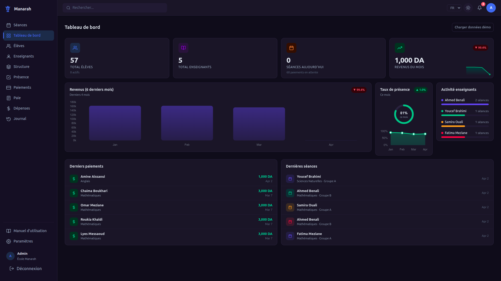
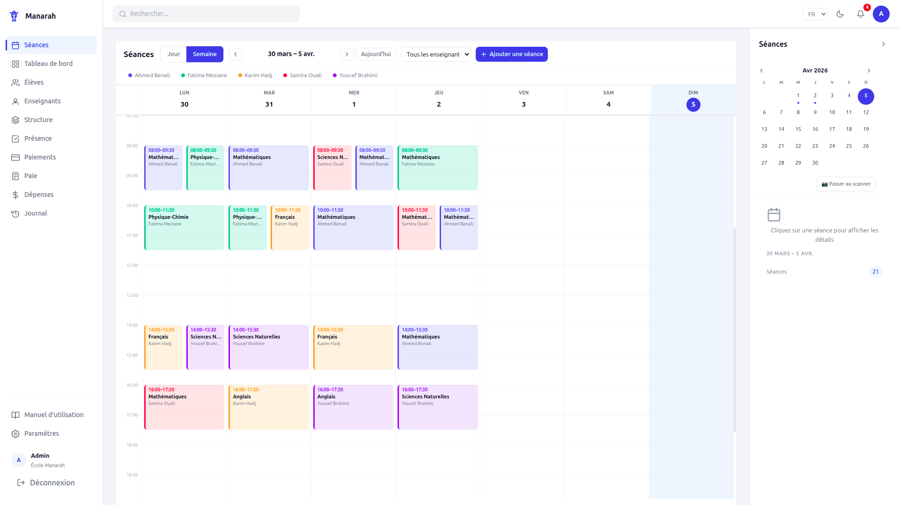
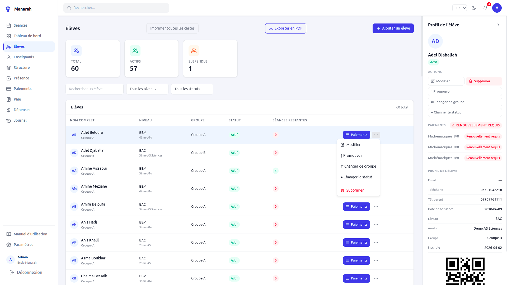
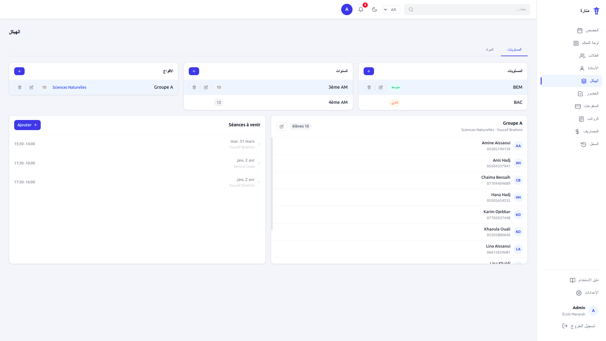

# Manarah — Private School Management System

> A full-stack SaaS platform built for Algerian private tutoring centers and schools.  
> Handles the full lifecycle: students, teachers, sessions, QR attendance, and financial reporting.

---

## Overview

Manarah (منارة — "lighthouse" in Arabic) is a production-ready school management system designed specifically for private educational institutions in Algeria. It replaces paper-based tracking with a clean digital workflow — from enrollment to payroll.

Built solo as a portfolio project, with a focus on real-world usability, clean architecture, and a polished UI.

---

## Screenshots

| Dashboard | Sessions Calendar |
|-----------|------------------|
|  |  |

| QR Attendance | Student ID Cards |
|----------------------|-----------------|
|  |  |

---

## Key Features

### Academic Management
- **Multi-level structure** — Levels (BAC/BEM/etc.), years, groups, and modules with full CRUD
- **Students** — Enrollment, status management (active/suspended/archived), group transfers, year promotion
- **Teachers** — Profile management, module assignments, configurable revenue split percentage

### Sessions & Attendance
- **Visual calendar** — Daily and weekly views with drag-to-add, overlap detection, and teacher color coding
- **QR code attendance** — Each student has a unique QR card; controller scans to mark presence
- **Smart auto-detection** — Scanner auto-matches student to the correct open session by group
- **Attendance toggle** — Manual override per student; locked when session is closed
- **Student ID cards** — Printable business-card format, 6 per A4 page

### Financial Tracking
- **Payments** — Monthly, pack, yearly, and custom types with automatic teacher/school revenue split
- **Teacher payroll** — Monthly earnings per teacher with session-based breakdown
- **Expenses** — Categorized school operating costs (rent, bills, supplies, other)
- **Dashboard charts** — Revenue trends, attendance rate evolution, month-over-month comparisons

### Portals & Roles
| Role | Access |
|------|--------|
| **Admin** | Full access — school config, users, financials, structure |
| **Staff / Controller** | Sessions, attendance scanning, student management |
| **Teacher** | Personal portal — upcoming sessions, past sessions, earnings, profile |

### System
- **Multi-language** — French (default), Arabic (RTL), English via i18next
- **Dark / Light mode** with persistent preference
- **Demo seed** — One-click realistic dataset (13 weeks of sessions, payments, attendance trends)
- **JWT authentication** — Secure role-based access control
- **School info panel** — Admin sees student/teacher/group counts with editable school details

---

## Tech Stack

| Layer | Technology |
|-------|-----------|
| **Frontend** | React 18, plain CSS (custom design system), React Router, react-i18next |
| **Charts** | Chart.js via react-chartjs-2 |
| **QR Codes** | jsQR (camera decoding) + qrcode (generation) |
| **Backend** | Node.js, Express |
| **Database** | SQLite (better-sqlite3) — swap-ready for PostgreSQL |
| **Auth** | JWT (jsonwebtoken) + bcryptjs |
| **PDF/Print** | Browser print API with custom CSS layout |

---

## Project Structure

```
Manarah/
├── client/                  # React frontend (Vite)
│   └── src/
│       ├── api/             # Axios instance + per-resource clients
│       ├── components/      # Shared UI: Layout, Sidebar, Badge, DetailPanel…
│       ├── context/         # Auth + Theme context providers
│       ├── locales/         # fr.json · ar.json · en.json
│       ├── pages/           # One page per feature
│       └── utils/           # printQR, helpers
└── server/                  # Express API
    ├── controllers/         # Business logic per resource
    ├── db/                  # SQLite connection, schema.sql, demoSeed.js
    ├── middleware/           # auth.js (JWT + role guards)
    ├── models/              # User model
    └── routes/              # One router per resource
```

---

## Getting Started

### Prerequisites

- Node.js 18+
- npm

### Installation

```bash
# 1. Clone
git clone https://github.com/Alaeddine-Nasri/Manarah.git
cd Manarah

# 2. Backend
cd server
cp .env.example .env        # edit JWT_SECRET
npm install
npm run dev                 # starts on :3001

# 3. Frontend (new terminal)
cd ../client
npm install
npm run dev                 # starts on :5173
```

### Load demo data

Log in as admin, go to **Paramètres → Démo**, and click **Charger les données de démonstration**.  
This seeds 13 weeks of realistic sessions, attendance (with a visible March dip), payments, and expenses.

---

## Demo Credentials

| Role | Email | Password |
|------|-------|----------|
| Admin | `admin@manarah.com` | `admin123` |
| Teacher (any) | `ahmed.benali@demo.ma` | `teacher123` |

---

## Environment Variables

```env
PORT=3001
CLIENT_URL=http://localhost:5173
JWT_SECRET=change_me_in_production
DB_PATH=./data/manarah.db
```

---

## Roadmap

- [ ] Mobile-responsive layout
- [ ] PostgreSQL / cloud DB support
- [ ] SMS / WhatsApp absence notifications to parents
- [ ] Parent portal (read-only attendance + payment history)
- [ ] Multi-school superadmin dashboard

---

## Author

**Alaeddine Nasri** — [@Alaeddine-Nasri](https://github.com/Alaeddine-Nasri)

---

## License

MIT
